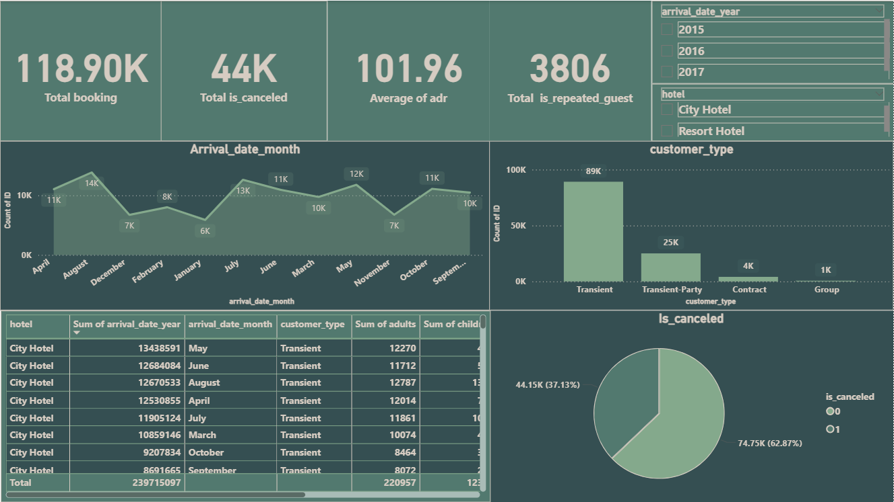

🏨 Hotel Data Analysis Dashboard using Power BI

## 📘 Project Description
This project focuses on analyzing **hotel booking data** to gain valuable insights into customer behavior, booking trends, and hotel performance.  
The dashboard provides an interactive and visual representation of key performance metrics (KPIs) that help improve operational efficiency and decision-making.

---

## 🖼️ Dashboard Preview

---

## 🚀 Features
- Interactive dashboard with filters for hotel type, time, and customer segment  
- Real-time performance tracking for bookings, revenue, and cancellations  
- Data modeling and relationships built between multiple tables  
- Visual KPIs for occupancy rate, revenue, and average daily rate (ADR)  
- Insights into customer demographics and stay duration  

---

## 📊 Key KPIs
| KPI | Description |
|-----|--------------|
| **Total Bookings** | Total number of bookings across both city and resort hotels |
| **Revenue** | Total revenue generated from confirmed bookings |
| **Average Daily Rate (ADR)** | Average rate charged per room per day |
| **Cancellation Rate** | Percentage of bookings that were cancelled |
| **Occupancy Rate** | Ratio of occupied rooms to total available rooms |

---

## 🧠 Insights
- 🏙️ **City Hotels** had higher booking volumes but lower average revenue per booking compared to resort hotels.  
- 🌴 **Resort Hotels** generated more revenue per stay, indicating longer or more premium visits.  
- ❌ A noticeable **cancellation rate** was observed during the high season, suggesting possible overbooking or customer indecision.  
- 📅 **Peak booking months** showed strong patterns, ideal for targeted promotions and staffing optimization.  
- 💼 Most guests were **repeat customers**, showing strong loyalty and satisfaction levels.

---

## ⚙️ Tools & Technologies
- **Power BI** – Dashboard design, data modeling, and visualization  
- **Excel / CSV** – Raw data preparation and transformation  
- **DAX** – Custom calculations and KPI measures  
- **Power Query** – Data cleaning and transformation  

---

## 🧩 Data Analysis Process
1. **Data Collection:** Imported raw data from `hotel1.csv`  
2. **Data Cleaning:** Removed duplicates, handled nulls, and normalized data fields  
3. **Data Modeling:** Created relationships between fact and dimension tables  
4. **DAX Calculations:** Built custom KPIs (e.g., ADR, Cancellation %, Occupancy Rate)  
5. **Dashboard Design:** Developed interactive visuals and slicers for deep insights  
6. **Testing & Validation:** Verified accuracy of KPIs and relationships  

---

## 💡 Business Insights
- Hotels can **optimize pricing strategies** based on seasonal trends.  
- High cancellation rates indicate a need for **better reservation policies**.  
- Loyal customer behavior shows opportunities for **membership programs**.  
- Visualized trends make it easy for management to **forecast demand** and plan ahead.  

---

## 🏁 Conclusion
The **Hotel Data Analysis Dashboard** delivers an efficient, data-driven way to monitor hotel operations.  
By visualizing performance metrics in Power BI, hotel managers can identify trends, improve customer satisfaction, and make informed strategic decisions.

